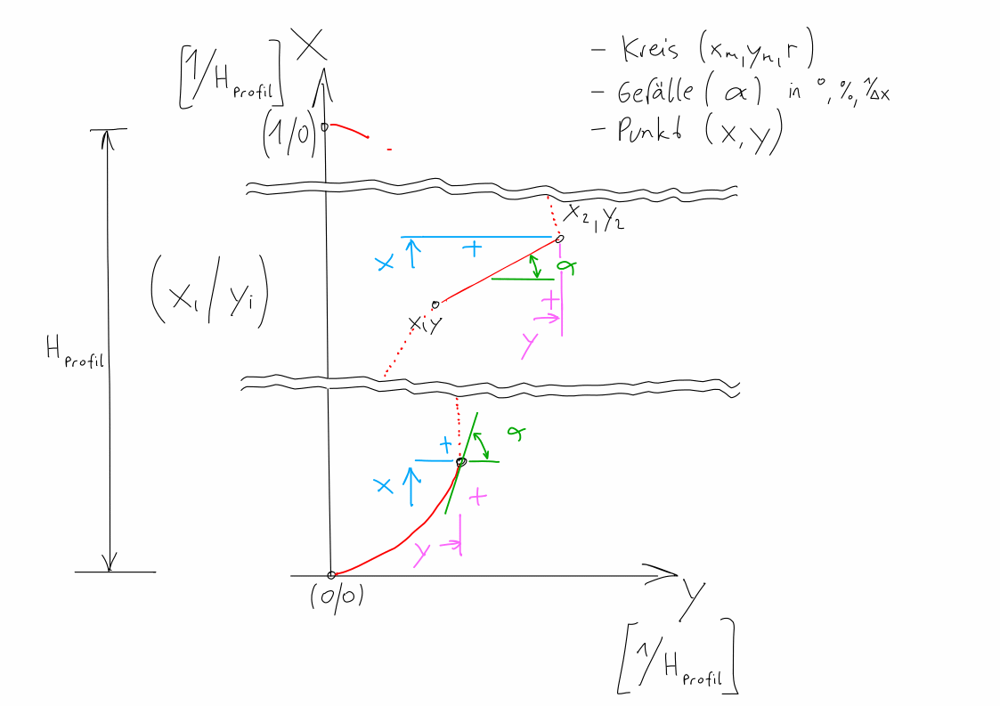
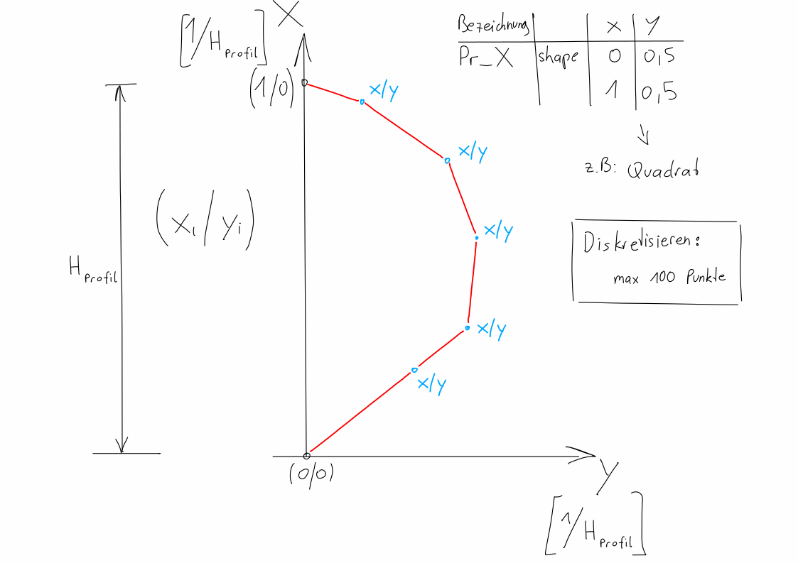

General information
======================

This application should help you to generate cross-sections for the US-EPA Storm Water Management Model (SWMM) [#f1]_.

To understand the general usage of shapes in context to cross-sections,
read the documentation of SWMM provided on the official website of EPA [#f1]_.

Units
"""""

The unit can be chosen freely, but must be consistent.

    Make a some basic forms for the shape

    A simple example of a shape

.. --------------------------------------------------------

.. rubric:: Footnotes

.. [#f1] Official website of US-EPA SWMM https://www.epa.gov/water-research/storm-water-management-model-swmm

